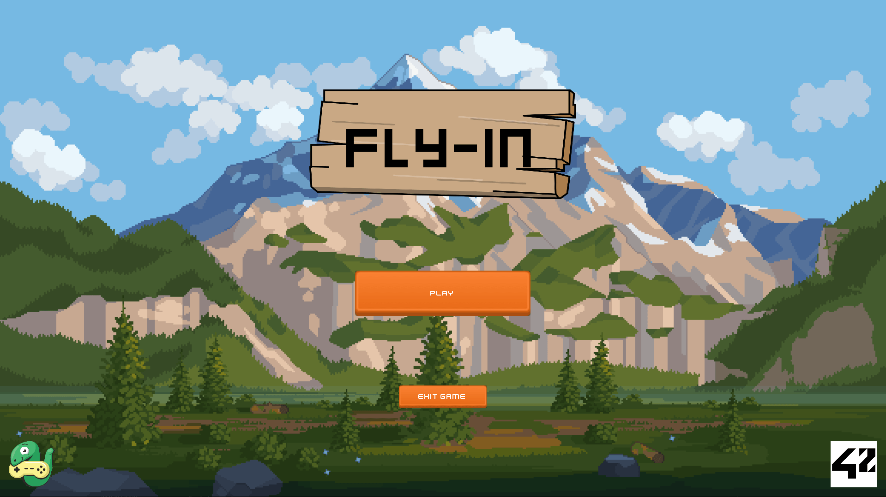
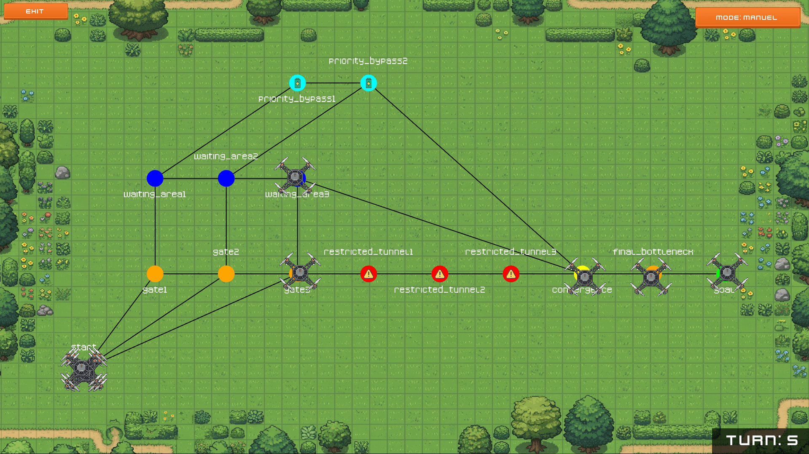

_This project has been created as part of the 42 curriculum by marberge._

<div align="center">
<br>
  

  <br>
</div>

# Fly-in

<div align="center">
	
	
	
	<br>
	
	
	
	
	
</div>

<div align="center">
	<br>
  		
	<br>
</div>

## I. Description

Design an efficient drone routing system that navigates multiple drones
through connected zones while minimizing simulation turns and handling movement
constraints.

### Overview

Fly-in is a 2D simulation and visualization engine built in Python using the Arcade library. The project parses complex network maps and simulates a fleet of drones navigating from a designated starting hub to an end hub. The engine enforces strict routing rules, including link capacities, hub limits, and restricted zone entry delays, while offering a highly optimized graphical interface to observe the swarm's behavior in real-time.

### Key Feature

- **Smart Pathfinding:** Modified Dijkstra's algorithm featuring dynamic micro-penalties to automatically balance traffic across symmetrical routes.
- **High-Performance Rendering:** Custom batch-rendering architecture using Arcade's `ShapeElementList`, ensuring a smooth 60 FPS even on massive networks like the Challenger map.
- **Interactive UI:** A fully decoupled Heads-Up Display (HUD) offering real-time turn tracking and seamless toggling between Manual (step-by-step) and Auto (continuous) simulation modes.
- **Fail-Safe Lazy Loading:** Breadth-First Search (BFS) integration to instantly validate map solvability before rendering, preventing crashes on broken topologies.

<div align="center">
	<br>
  		
	<br>
</div>

<br>

## II. Instructions

### Prerequisites
Before using this template, ensure you have the following installed on your system:
- **Python 3.10+**
- **uv 0.10.12+**

### Quick Start
To set up the environment and run the project for the first time, simply use the following command in your terminal:

	make run

### Makefile Commands Reference
This project is fully automated using Make. Here is the complete list of available commands to manage the project lifecycle:

**Installation & Setup**
- `make install` (or **make all**): Initializes the virtual environment (.venv) and synchronizes all dependencies using uv.
- `make setup`: Checks your Python version and presence of the uv package manager. Exit if both check are not valid.

**Execution & Debugging**
- `make run`: Executes the main entry point (src/main.py) inside the isolated virtual environment.
- `make debug`: Launches the project using the Python Debugger (pdb), allowing you to step through your code line by line.

**Quality & Testing**
- `make lint`: Runs flake8 for style checking and mypy for static type checking to ensure code quality.
- `make lint-strict`: Runs the linters but enforces strict typing rules with mypy.
- `make test`: Runs the entire test suite using pytest.
- `make test-file ARGS=path/to/test.py`: Runs a specific test file. Replace the FILE variable with your target.

**Building & Cleaning**
- `make clean`: Removes all temporary files, such as __pycache__ folders and linter caches.
- `make fclean`: Performs a deep clean. It executes the clean rule and also removes the virtual environment and build files.
- `make re`: Rebuilds the project from scratch by running fclean followed by all.

<br>

<details> <summary><h2>Project tree</h2></summary>

### Project Structure

Here is an overview of the codebase architecture, separated by concerns (UI, Core Logic, Views):

``` bash
	src
	├── components              # => Reusable graphical components and UI elements
	│   ├── button.py           # -> Interactive clickable buttons
	│   ├── dialog.py           # -> Modal pop-ups (e.g., end-of-level victory screen)
	│   ├── map_hud.py          # -> Heads-Up Display managing the UI overlay (turns, buttons)
	│   ├── map_renderer.py     # -> Optimized static rendering engine for the map topology
	│   ├── text.py             # -> Custom styled text component
	│   ├── visual_drone.py     # -> Drone sprite logic with waypoint queuing and dynamic speed
	│   └── visual_hub.py       # -> Hub rendering logic including specific zone icons


	├── core                    # => Core business logic and algorithmic engines
	│   ├── graph.py            # -> Data structure modeling the network (Hubs and Connections)
	│   ├── map_manager.py      # -> Registry and loader for parsing available map files
	│   ├── pathfinding.py      # -> Custom Dijkstra's algorithm with dynamic load balancing
	│   └── simulation.py       # -> Turn-based engine enforcing movement rules and limits


	├── main.py                 # -> Application entry point and Arcade window initialization


	├── utils                   # => Shared utilities and helper functions
	│   ├── errors.py           # -> Custom exception definitions
	│   ├── get_path.py         # -> Absolute path resolution for safe asset loading
	│   ├── logger.py           # -> Custom logging configuration for debugging
	│   ├── map_utils.py        # -> Geometric math, screen scaling, and drone offset logic
	│   ├── models.py           # -> Data structures and strict typing definitions (LevelData)
	│   └── parser.py           # -> Custom parser to read, clean, and validate map files


	└── views                   # => Main application screens (Arcade View controllers)
	    ├── difficulty_view.py  # -> Screen for selecting game difficulty
	    ├── error_view.py       # -> Fallback screen when a map fails BFS validation
	    ├── level_view.py       # -> Screen for selecting a specific map level
	    ├── map_view.py         # -> Main controller orchestrating Core, Renderer, and HUD
	    └── menu_view.py        # -> Main title screen and entry menu
```

</details>


<br>

## III. About this project

### Algorithm Explanation

The core navigation relies on a highly customized **Dijkstra's Algorithm** designed to handle complex network rules and traffic congestion seamlessly:
- **Priority Weights:** Normal zones have a base traversal cost of 1.0. "Priority" zones are weighted at 0.9. This mathematical subtlety guarantees that a drone will always favor a priority lane over a normal one when distances are equal, without forcing the drone into absurd, map-spanning detours just to stay on a priority path. Restricted zones are heavily penalized with a weight of 2.0.
- **Dynamic Load Balancing (The Micro-Penalty):** To prevent all drones from piling into the exact same route on perfectly symmetrical maps, the algorithm applies a cumulative micro-penalty (+0.00001) to paths already reserved by previous drones. This acts as a mathematical tie-breaker, elegantly splitting the fleet across parallel routes and completely eliminating traffic jams without triggering unnecessary zig-zags.
- **BFS Validation:** A Breadth-First Search algorithm evaluates map topologies during level selection. If no valid path exists between the start and end hubs, the algorithm immediately intercepts the request and routes the user to a custom ErrorView, ensuring total application stability.

### Turn Processing Algorithm

The engine strictly separates logical processing from visual rendering. 
At each tick, the `SimulationEngine` sequentially queries the logical state of every drone. The engine enforces physical map limits: if a hub has reached its maximum drone capacity, or a connection link is saturated, approaching drones are forced to wait. Restricted zones require a two-tick logical sequence (entry and processing). Once the entire fleet's logical positions are calculated for the turn, the updated coordinates are pushed to the visual components.

### Visual Representation

The application's architecture heavily utilizes **Composition** to provide a stellar and highly optimized User Experience:
- **Batch Rendering (The MapRenderer):** To prevent CPU bottlenecking on complex maps, all static vector graphics (connection lines, hub borders) are pre-calculated and packaged into an `arcade.shape_list.ShapeElementList`. This allows the GPU to draw the entire map topology in a single, lightning-fast draw call.
- **Deterministic Jitter:** To prevent sprites from overlapping into a single unreadable mass when multiple drones wait on the same hub, the engine applies a modulo-4 mathematical offset to their exact coordinates. Drones automatically arrange themselves neatly in the four corners of a hub.
- **Waypoint Queuing:** The visual drones use a waypoint queue system (`move_to`) rather than instant teleportation. If the user spams the manual progression key faster than the animation can play, the drones dynamically accelerate along the actual graph edges instead of cutting corners through the map.

<br>

## IV. Resources
- Arcade library :
	- https://api.arcade.academy/en/stable/index.html
- Free 2D game assets :
	- https://craftpix.net/
- Dijkstra's Algorithm: Classic pathfinding in weighted graphs :
    - https://www.w3schools.com/dsa/dsa_algo_graphs_dijkstra.php
    - https://www.maths-cours.fr/methode/algorithme-de-dijkstra-etape-par-etape#google_vignette
- Graph theory and network topology optimization :
    - https://fr.wikipedia.org/wiki/Th%C3%A9orie_des_graphes
    - https://www.apprendre-en-ligne.net/graphes/graphes.pdf
- Heap-based priority queues (Python heapq) and deque (double-ended queue):
    - https://docs.python.org/3/library/heapq.html
	- https://docs.python.org/3.14/library/collections.html#collections.deque

<br>


- **Artificial Intelligence Usage:** AI (LLM) was utilized throughout the development process as an interactive pedagogical assitant. It assisted in : 
	- Brainstorming architectural design patterns
	- Optimizing standard Python data structures
	- Explaining Dijkstra's Algorithm and helping to implement in code
	- Debugging algorithmic edge-cases during drone simulation and parsing
	- Writing and translating this Readme.